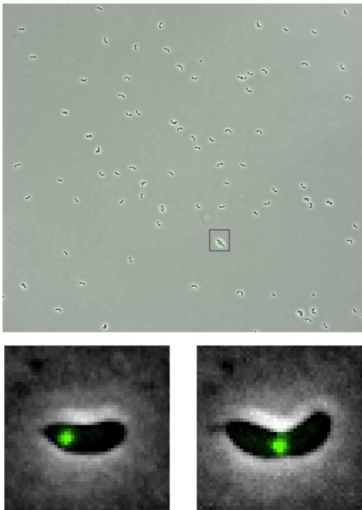

# Project SPB : Spot in bacteria

### Description
This project had for objective to quantify the dynamic behavior of replisomes foci
in a *Caulobacter crescentus* bacteria, notably by measuring the movement of each replisome
to the referential of its bacterium. This would allow comparison between different
colonies by using the quantitative data measured from the processed images.

### Plugin Installation

To install this plugin, move the file named **main.jar in the target folder (...\Bioimage-Informatic_project\target)** to your fiji plugin 
directory (...\Fiji.app\plugins") or the other distribution of ImageJ you are using.

### Compatible type of data

The type of data expected to be processed should have the following 
characteristics :
- TIFF format
- 2 channels
    - ch1 : Phase contrast, Cell morphology (bacilli)
    - ch2 : Fluorescence, replisome foci.
- 2D or 2D + t
  - With t as frame
- Following metadata
  - Pixel width
  - Pixel height

Additionnaly, the following parameters are needed and asked for at the 
beginning of the plugin execution :
- Time interval between frames (if 2D + t image)
- Estimated maximum bacilli length in pixel (if using the Skeleton method - 
see next section)

### How to use - Procedure

Please follow this procedure to obtain optimal image processing from this plugin :
1. Open your ImageJ distribution (example : Fiji)
2. Select under Plugins -> BII -> Replisome_tracking
3. Choose the TIFF file to be processed by entering the absolut path or clicking on the "Browse" button
4. Time interval between frames in seconds.
5. If the image is pre-segmented, tick the case.
6. Launch execution by clicking the "OK" button.
7. Choose between segmentation methods for the cells
   1. Skeleton Segmentation : Uses thresholding and the extremities found by skeletonization to segment cells.
      Good with separated, end-to-end touching, or horizontlly oriented groups of bacilli.
      Does not perform well with side-by side touching bacilli.
   2. Level Sets Segmentation : Uses the Level Sets plugin (MUST BE INSTALLED SEPARATLY). to segment cells.
      Good with separated & groups of multiple orientation bacilli,
      but less performant with side-by-side and end-to-end touching bacilli.

### Expected outputs

- Graphs
  - Total displacement of each detected replisome by index number
  - Speed of each detected replisome by index number
  - Replisome position relative to the bacteria centroid through time

### Resources

Alternative ML technique to detect bacterias: 
- [DeepBacs](https://www.nature.com/articles/s42003-022-03634-z)
- [Omnipose](https://omnipose.readthedocs.io/notebook.html)

Other useful resources:
- [FindMaxima documentation](https://imagej.net/ij/developer/api/ij/ij/ImagePlus.html)
- 
